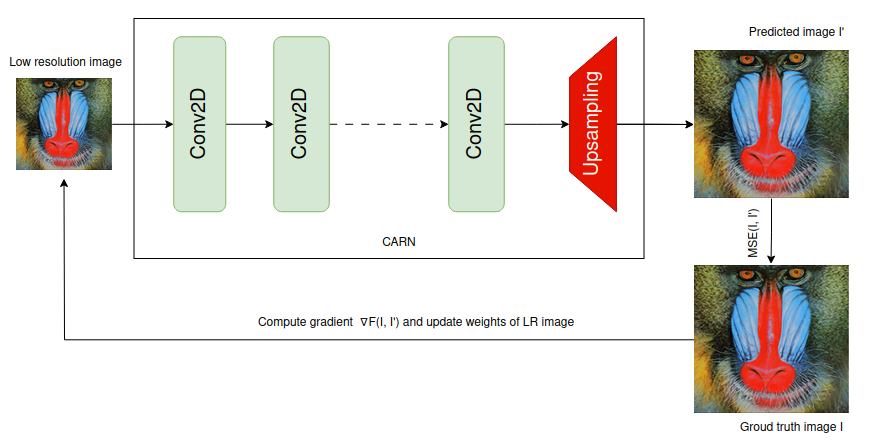
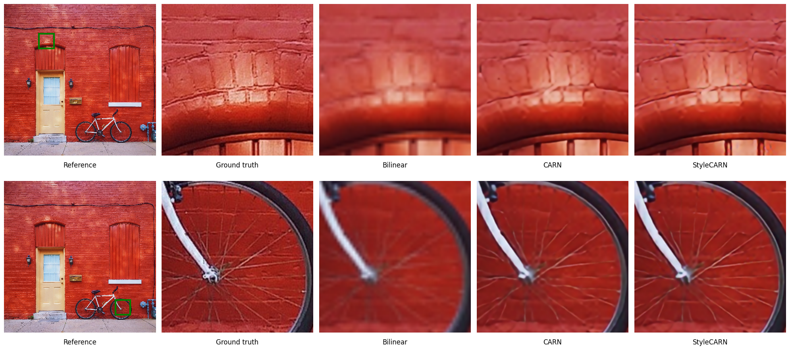

# ML Engineer Home Assignment

The task involves working with a super-resolution (SR) neural network that should be older than 2018. You will also need a test dataset for SR (e.g., DIV2K, but you can choose another dataset).

## Task Description

1. Evaluate the performance of the chosen SR network on the test dataset.

2. Propose a one-shot learning method to improve the performance of the selected SR network on a specific image. The goal is to enhance the network's output quality for the chosen image without significantly slowing down inference. You are not allowed to use methods that substantially slow down inference, and it is preferable to use style transfer methods.

## Task Details

- You have access to the original source image in the codecs, which is of the highest quality. You can use it to enhance the SR network's performance.

- Any solution that improves SR quality compared to the original network and works on any test images from the chosen dataset is considered positive.

## Repository Structure

- `codec.ipynb`: Contains the source code for the ML assignment.
- `img/`: Folder for images used in this README.

## Results and Images 
- Image illustrating the architecture of the selected SR network.

- Image displaying the results of the task.

## How to Reproduce the Results

1. Clone this repository:

`git clone https://github.com/peanutwolf/StyleCARN.git`

2. Set up your environment and install any necessary dependencies.

3. Run the code provided in the `codec.ipynb` to reproduce the results.

